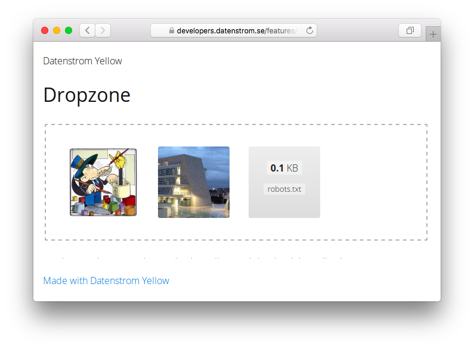

# Dropzone 0.8.17

Drag-and-drop file uploads with image previews.

## How to install an extension

[Download ZIP file](https://github.com/GiovanniSalmeri/yellow-dropzone/archive/refs/heads/main.zip) and copy it into your `system/extensions` folder. [Learn more about extensions](https://github.com/annaesvensson/yellow-update).

## How to create a drag-and-drop area for file uploads

Create a `[dropzone]` shortcut. 

In this way you will allow visitors, without any authentication, to upload files to directory `media/uploads`. To limit abuses you could want to make the page unlisted with a setting `Status: unlisted`, or to protect with a password with the extension [Private](https://github.com/schulle4u/yellow-private) or [Restrict](https://github.com/GiovanniSalmeri/yellow-restrict).

The following arguments are available, all are optional:

`AcceptedFiles` = comma separated list of file extensions allowed   
`MaxFilesize` = maximum size of a single file, in MB  

These arguments override the general settings.

## Examples

Embedding a drag-and-drop area with various options:

    [dropzone]
    [dropzone ".jpg,.gif,.png"]
    [dropzone .zip 100]

## Settings

The following settings can be configured in file `system/extensions/yellow-system.ini`:

`DropzoneDirectory` = directory where files are uploaded  
`DropzoneExtensions` = a comma separated list of file extensions allowed  
`DropzoneFileSizeMax` = maximum size of a single file, in MB  
`DropzoneOverwrite` = whether files with the same name are overwritten (if not, after `file.txt` they are renamed `file.1.txt`, `file.2.txt` and so on)  

## Acknowledgements

This extension includes [DropzoneJS](https://www.dropzonejs.com/) by Matias Meno. Thank you for the good work.

## Developer

Giovanni Salmeri. [Get help](https://datenstrom.se/yellow/help/).
